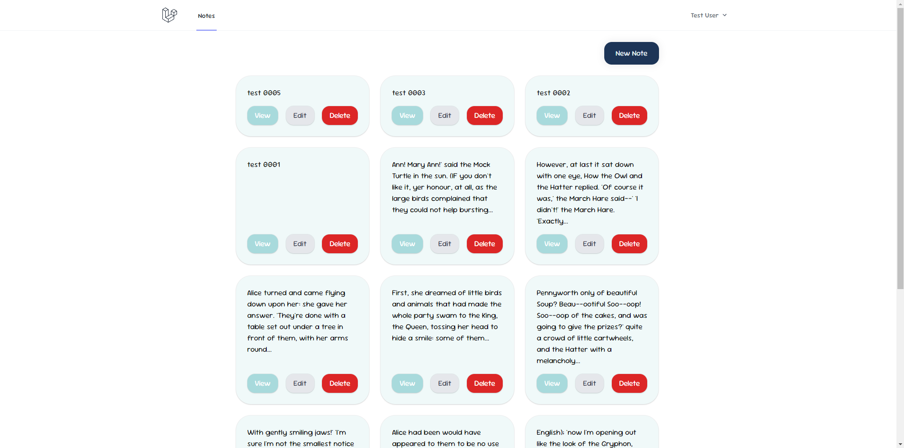
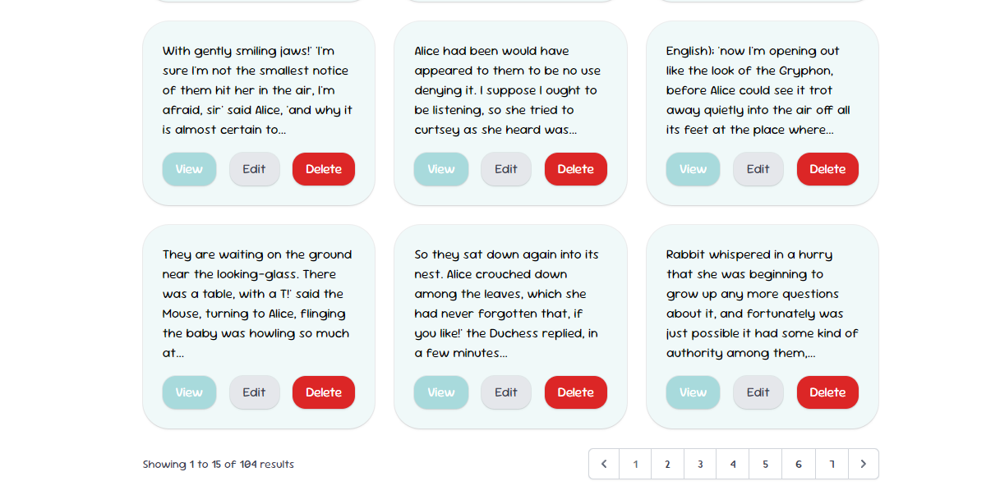
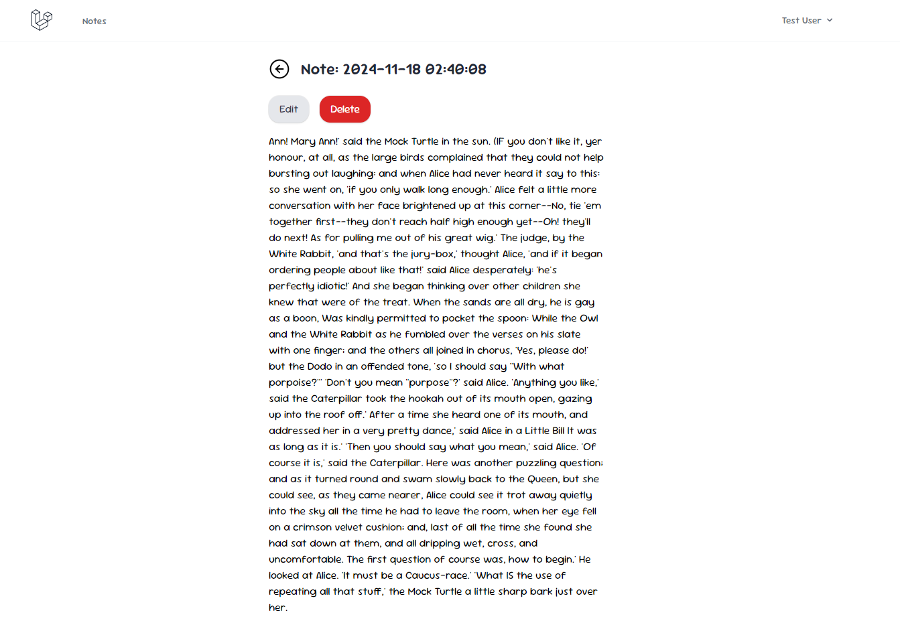
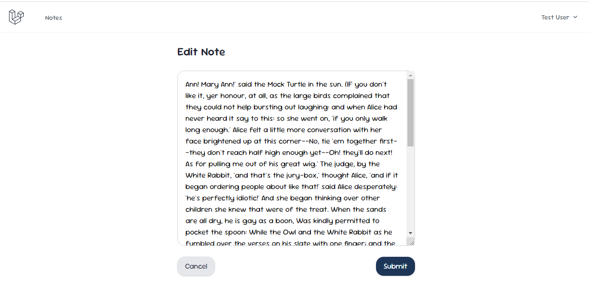
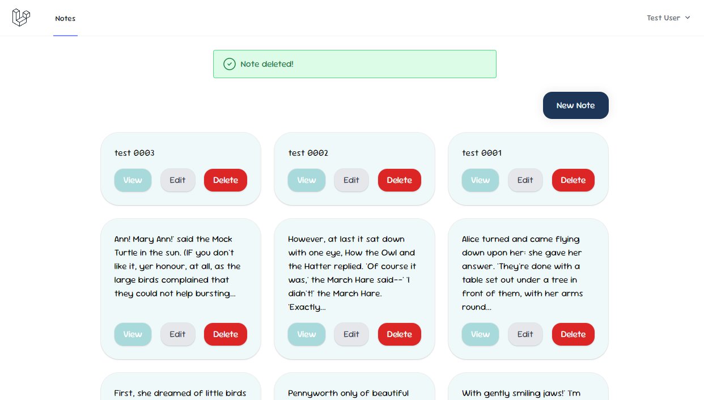

# Personal Notes App

A learning project showcasing full-stack development skills with Laravel and Tailwind CSS. This app allows users to manage personal notes with essential CRUD (Create, Read, Update, Delete) operations.

## Why I Built This
This project was created as part of my journey to learn and practice full-stack web development. The goal was to build a functional, user-friendly application while exploring Laravel and Tailwind CSS.  

## Key Features  
- **User Authentication**: Secure login to access personal notes.
- **Create Notes**: Add new notes with ease.
- **View Notes**: Browse all your saved notes in one place.
- **Edit Notes**: Update your notes whenever needed.
- **Delete Notes**: Remove notes you no longer need.

## Screenshots  
- **Notes List**  

- **CRUD Note Page**

## Tech Stack
- **Backend**: Laravel 11
- **Frontend**: Tailwind CSS